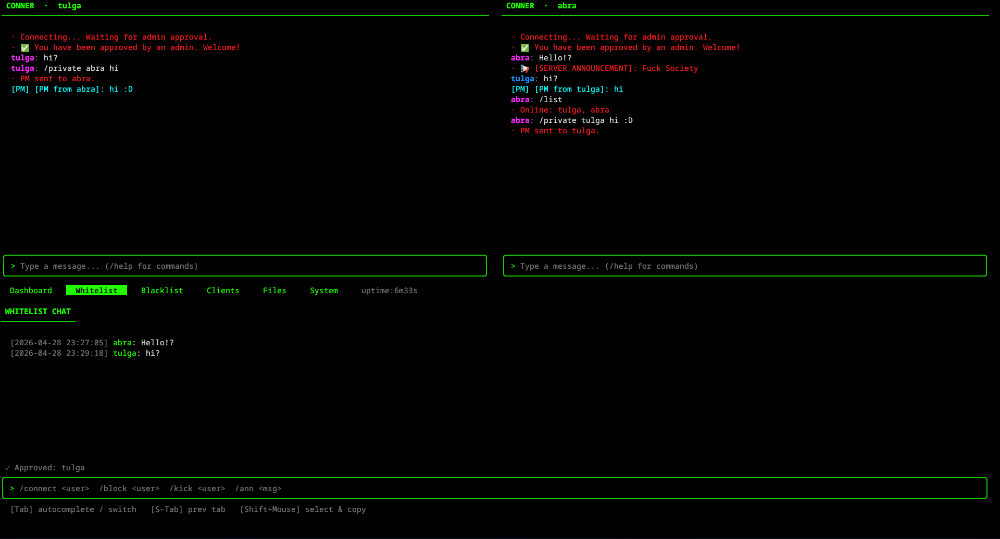
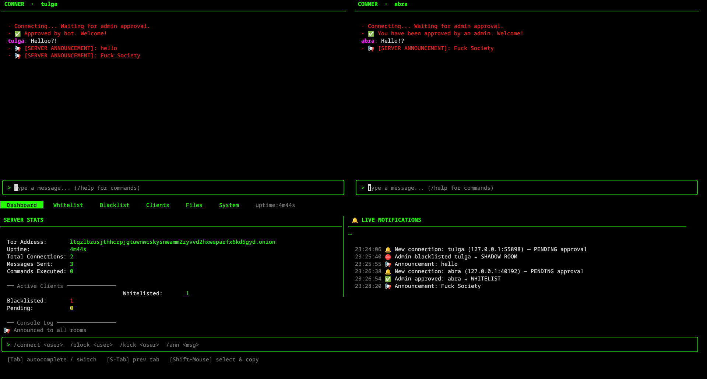

# CONNER

A terminal-based anonymous chat platform with a modern Matrix-themed TUI, Tor native routing, state-level client isolation, and rotating end-to-end encryption. **Fully hardened and rewritten in Go.**

[](https://opensource.org/licenses/MIT)
[](https://golang.org/dl/)
[](https://alpinelinux.org/)

---

## Overview

CONNER is a high-concurrency, ephemeral chat server designed for **absolute privacy**. Built with Go and Bubble Tea, it provides:
- A **zero disk I/O** guarantee — all messages and media live exclusively in RAM
- **Tor Hidden Service** native support — both server and client
- **Shadow Room Isolation** — Banned users see "Approved by bot" and are put in a parallel room
- **Military-grade E2EE** using X25519 key exchange and AES-GCM
- **Hardened Media System** — In-memory tar extraction with path traversal protection

## Screenshots

### End-to-End Encrypted Private Messaging


### Shadow Blacklist (Shadow Room)


---

## Features

| Feature | Description |
|:---|:---|
| **Goroutine Architecture** | Handles thousands of concurrent connections without blocking |
| **Pure RAM Storage** | Zero disk I/O. All history and media live in `sync.Map` and vanish on shutdown |
| **E2EE** | X25519 Diffie-Hellman session keys + AES-GCM per message |
| **Tor Native** | Server auto-detects `.onion` hostname; client auto-routes via SOCKS5 without DNS leaks |
| **Hardened Media** | 100MB limit, pre-flight size checks, in-memory extraction (G110/G305 safe) |
| **Shadow Blacklist** | Banned users are greeted by a bot and redirected to an isolated honeypot room |
| **Matrix-Themed TUI** | Rich colors (Purple/Blue/Orange), admin timestamps (Teal), and auto-completion |
| **Admin Dashboard** | 5-tab dashboard with live RAM monitoring, file detail cards, and event logs |
| **Tab Completion** | Intelligent auto-completion for all `/` commands in both client and server |
| **Anti-Forensics** | Shell history disabled, logs to `/dev/null`, tmpfs enforcement, iptables hardening |

---

## Commands

### Client Commands

| Command | Description |
|:---|:---|
| `/help` | Open the help menu (also: `F1`) |
| `/list` | List all online users in your current room |
| `/private <user> <msg>` | Send a private encrypted message |
| `/ann <message>` | *(Admin only)* Broadcast an announcement to your entire room |
| `/op <user>` | *(Admin only)* Grant admin privileges to another user |
| `/connect <user>` | *(Admin only)* Move a PENDING user to the Whitelist |
| `/block <user>` | *(Admin only)* Move a user to the Shadow Blacklist (Black Room) |
| `/upload <path>` | Upload a file (packaged as tar, 100MB limit) |
| `/download <id> <dir>` | Download a file by ID to a specific directory |
| `/quit` | Disconnect from the server |

**Tips:**
- `Tab`: Auto-complete `/` commands.
- `Shift + Mouse Drag`: Select and copy text from the terminal.
- `ESC`: Close help menus and overlays.

---

### Admin Dashboard CLI Commands
*(Typed directly into the Server TUI input bar)*

| Command | Description |
|:---|:---|
| `/connect <user>` | Approve a PENDING user → Whitelist |
| `/block <user>` | Shadow blacklist a user (stays in Black Room, bot approved) |
| `/kick <user>` | Terminate a user's connection immediately |
| `/ann <message>` | Broadcast announcement to all rooms (White & Black) |
| `/purge` | Wipe all message history from RAM |
| `Tab` | Auto-complete commands or switch tabs (if input is empty) |

---

### Admin Dashboard Tabs

| Tab | Description |
|:---|:---|
| **Dashboard** | Dual-column view: Server stats (left) and Live Event Feed (right) |
| **Whitelist** | Real-time chat history of approved users |
| **Blacklist** | Live feed of shadow-banned users talking to each other |
| **Clients** | Detailed list of all connections (IP, Nickname, State, Roles) |
| **Files** | File management: sorted list, RAM usage stats, and detailed file cards |
| **System** | Low-level monitoring: CPU Load, RAM Progress Bar, Network I/O, Service Status |

---

## Architecture

```text
conner/
├── cmd/
│   ├── client/       # Client entry point
│   └── server/       # Server entry point
├── internal/
│   ├── client/       # Client network core, hardened media handler
│   │   └── tui/      # Client TUI (Purple/Blue/Orange palette)
│   ├── config/       # Port, TTL, size limits, message types
│   ├── crypto/       # X25519 + AES-GCM wrappers
│   ├── protocol/     # JSON schemas + Length-Prefixed binary framing
│   └── server/       # TCP core, ClientManager, Shadow-Blacklist storage
│       └── tui/      # 5-tab Admin Dashboard (Bubble Tea)
└── scripts/          # Alpine install, entrypoint, anti-forensics, build
```

---

## Installation & Deployment

### Alpine Linux — Full Shielded Install

```bash
git clone <repo>
cd conner
sudo sh scripts/install-server.sh
```

The installer will:
1. Install `go`, `nginx`, `tor`, `iptables`, and `libc6-compat`
2. **Compile** CONNER binaries with security flags
3. Create a **restricted `conner` user** with no shell access
4. Generate a **Tor Hidden Service** (.onion)
5. Run the **Anti-Forensics Shield** (logs to null, tmpfs)

> [!IMPORTANT]
> **Pre-compiled Binaries (GitHub Releases):**
> When downloading from GitHub, binaries include architecture suffixes (e.g., `conner-server-linux-amd64`). The installer and the restricted shell expect the binary to be named exactly **`conner-server`** and located in the root directory or `bin/`. Please rename your downloaded binary accordingly before running the installation or the entrypoint.

### Automated Boot

```bash
sh scripts/entrypoint.sh
```

---

## Security Layer

| Layer | Mechanism |
|:---|:---|
| **Transport** | X25519 DH handshake + AES-GCM rotation |
| **Network** | Big-Endian Length-Prefixed framing (max 50MB frames) |
| **Media** | 100MB limit, G305 path traversal check, G110 bomb protection |
| **Shadow Room** | Persistent IP/Nickname blacklist; users see "Approved by bot" |
| **TUI Isolation** | `log.SetOutput(io.Discard)` prevents raw log bleed into terminal |
| **Anti-Forensics** | `/var/log` on tmpfs, logs to `/dev/null`, iptables DROP policy |

---

## Ecosystem & Built With

CONNER was developed using a suite of custom-built tools designed for efficient containerized workflows and Docker management.

### [laction](https://github.com/the-abra/local-actions)
A high-performance alternative to GitHub Actions (`act`) for local development. Used in this project to run build, test, and release steps (defined in `laction.ini`) within isolated Docker containers.
- **Why?** Faster feedback loops and 100% parity with CI environments.

### [dockero](https://github.com/the-abra/dockero)
A Docker client simplifier and CLI enhancement layer. It was used to rapidly prototype and manage the Alpine Linux containers used during the hardening phase of CONNER.
- **Why?** Intuitive commands and structured logging for complex container operations.

---

## License

This project is licensed under the MIT License.
