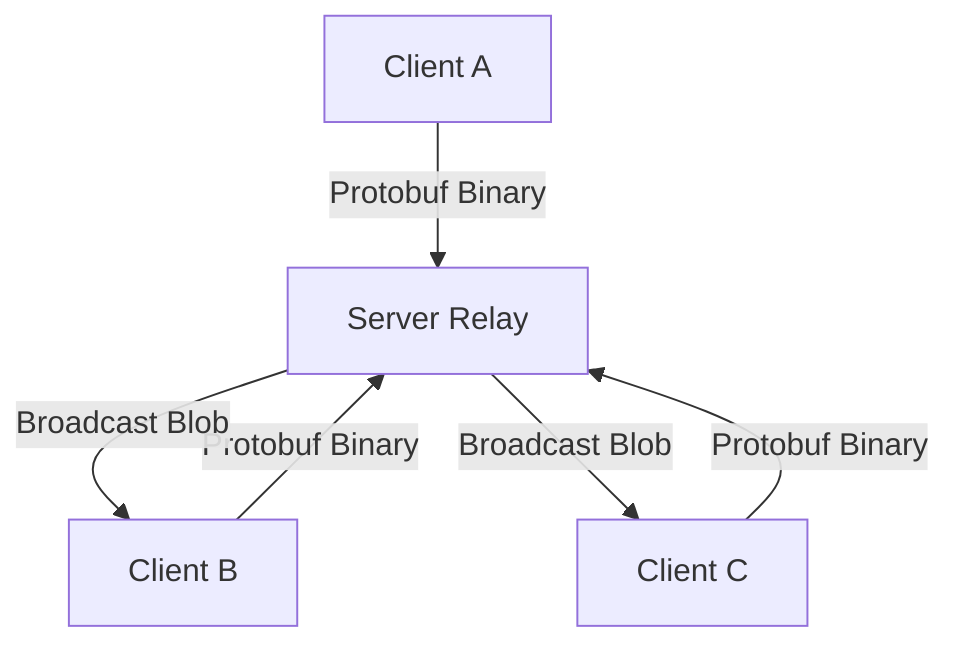

# CONNER Technical Workflow

This document outlines the operational lifecycle of the CONNER system, from connection establishment to encrypted message delivery and P2P file sharing.

## 1. Connection & Handshake (Identity Pinning)

CONNER does not use passwords. Instead, it uses **Ed25519 Identity Keys** with a pinning mechanism.

1. **Discovery**: The Client connects to the Server's address (Onion or IP, Port 6666).
2. **Challenge**: The Server sends a unique 32-byte random `Nonce` (challenge).
3. **Proof**: The Client signs this `Nonce` with its private identity key and sends back:
    - Public Identity Key
    - Signature
    - Proof-of-Work (PoW) solution (to prevent DDoS/spam connections).
4. **Verification & Pinning**: 
    - The Server verifies the signature and PoW.
    - If the nickname is new, the Public Key is **pinned** to that nickname.
    - If the nickname exists, the Public Key must match the pinned key.
    - If valid, the connection is accepted.
    - **Approval**: 
        - **Manual**: User enters a "PENDING" state until an admin runs `/approve`.
        - **Automatic**: If the server is started with `--auto-approve`, the user enters "WHITELISTED" state immediately.

## 2. The "Blind Relay" Architecture

The system uses a **Centralized Star Topology with End-to-End Encryption (E2EE)** and a binary communication protocol.

### Server Role:
- **Traffic Routing**: Forwarding **Protobuf** messages based on destination/broadcast rules.
- **Access Control**: Managing the Whitelist/Blacklist and Identity Pinning DB.
- **Persistence**: Storing the *encrypted* message history (in-memory) for synchronization.

### Client Role:
- **Key Management**: Managing the **Double Ratchet** for E2EE.
- **Encryption**: Encrypting message content into a ciphertext blob using **AES-256-GCM**.
- **Decryption**: Converting received blobs back into human-readable text using the current Ratchet state.

## 3. Message Lifecycle

1. **Input**: User `abra` types `Hello` in the TUI.
2. **Encryption**: Client A uses the current **Ratchet Key** to encrypt the string.
3. **Framing**: The encrypted blob is wrapped in a `ChatMessage` Protobuf frame.
4. **Transmission**: The binary frame is sent over the network (Tor or Direct) to the Server.
5. **Relay**: The Server broadcasts the frame to all authorized clients.
6. **Reception**: Client B receives the frame, extracts the blob, and uses its local Ratchet state to decrypt it.
7. **Resilience**: If the network drops at any point, the **Reconnection Engine** automatically restores the session and synchronizes missing history blobs.
8. **Display**: "Hello" appears on Client B's TUI.

## 5. Automated File Synchronization (The "Sync" Engine)

CONNER provides a seamless background synchronization experience:
1. **Detection**: Clients monitor the local `./uploads/` directory for changes.
2. **Metadata Broadcast**: When a new file is detected, its metadata (hash, size, type) is broadcasted.
3. **Download**: Peers receiving the metadata automatically fetch the file:
    - **Direct Mode**: Fetched from the server's **Vault** (dynamic port).
    - **Tor Mode**: Fetched via **P2P Onion transfers**.
4. **Ingestion**: Received files are automatically saved and "installed" into the `./downloads/` directory.

## 6. Security Guarantees

- **Zero-Knowledge**: The Server never sees plaintext content or file data.
- **Perfect Forward Secrecy**: The Double Ratchet ensures that even if a key is compromised, past and future messages remain secure.
- **MITM Protection**: Identity Pinning prevents attackers from impersonating users by spoofing nicknames.
- **Anonymity**: Tor integration hides the physical location of both the relay and the participants.
