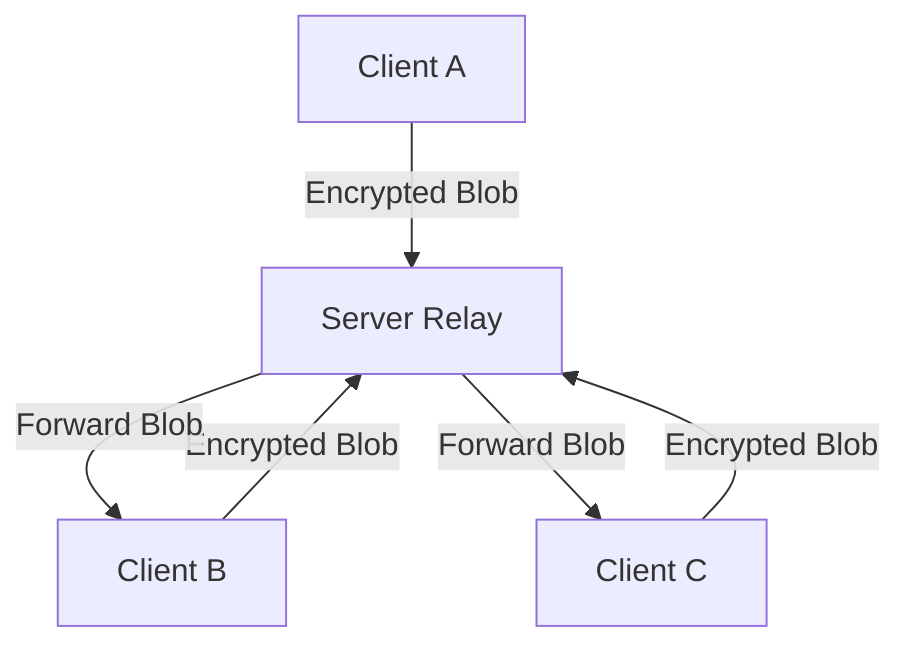

# CONNER Technical Workflow

This document outlines the operational lifecycle of the CONNER P2P system, from connection establishment to encrypted message delivery.

## 1. Connection & Handshake (Identity Proof)

CONNER does not use passwords. Instead, it uses **Ed25519 Identity Keys**.

1. **Discovery**: The Client connects to the Server's `.onion` address (Port 80).
2. **Challenge**: The Server sends a unique 32-byte random `Nonce` (challenge).
3. **Proof**: The Client signs this `Nonce` with its private identity key and sends back:
    - Public Identity Key
    - Signature
    - Proof-of-Work (PoW) solution (to prevent DDoS/spam connections).
4. **Verification**: The Server verifies the signature and PoW. If valid, the connection is accepted and the user enters a "PENDING" state until an admin approves them.

## 2. The "Blind Relay" Architecture

The system uses a **Centralized Star Topology with End-to-End Encryption (E2EE)**.

### Server Role:
- **Traffic Routing**: Forwarding packets based on destination IDs.
- **Access Control**: Managing the Whitelist/Blacklist.
- **Persistence**: Storing the *encrypted* message history so new users can catch up.
- **Isolation**: In `--stealth` mode, the server uses NGINX to strip all TCP metadata, making the traffic look like a generic, non-identifiable stream.

### Client Role:
- **Key Management**: Generating and storing the shared group keys.
- **Encryption**: Encrypting "Hello" into a ciphertext blob (e.g., `4YWnNrYy...`) using AES-256-GCM.
- **Decryption**: Converting received blobs back into human-readable text.

## 3. Message Lifecycle

1. **Input**: User `abra` types `Hello` in the TUI.
2. **Encryption**: Client A uses the **Group Key** (shared among trusted members) to encrypt the string.
3. **Framing**: The encrypted blob is wrapped in a `conner.proto` binary frame.
4. **Transmission**: The frame is sent over the Tor circuit to the Server.
5. **Relay**: The Server receives the frame, identifies it as a `MsgTypeChat`, and broadcasts it to all other "WHITELISTED" clients.
6. **Reception**: Client B receives the frame, extracts the blob, and uses the same **Group Key** to decrypt it.
7. **Display**: "Hello" appears on Client B's TUI.

## 4. Why this is Secure?

- **Zero-Knowledge**: Even if the Server is compromised, the attacker only gains access to encrypted blobs. Without the Group Keys (which never leave the clients), the messages are useless.
- **Tor Anonymity**: Neither the Server nor the Clients know each other's physical IP addresses. They only know the `.onion` identity.
- **Plausible Deniability**: Since messages are authenticated using symmetric tags (GCM), an attacker cannot prove *who* specifically sent a message after the fact, only that it came from someone with the key.
